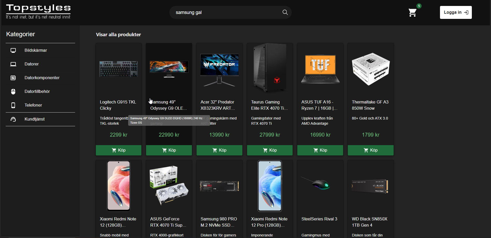
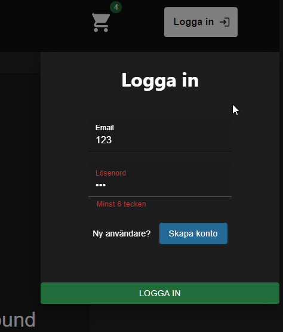
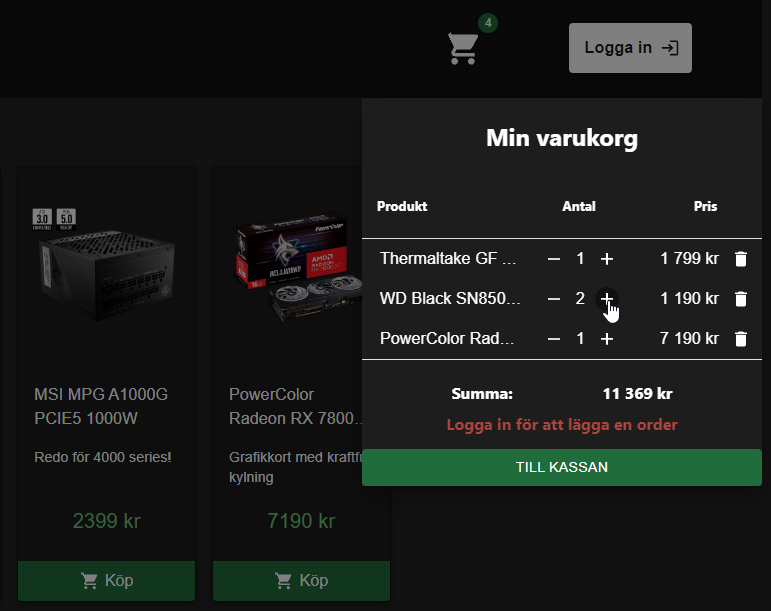
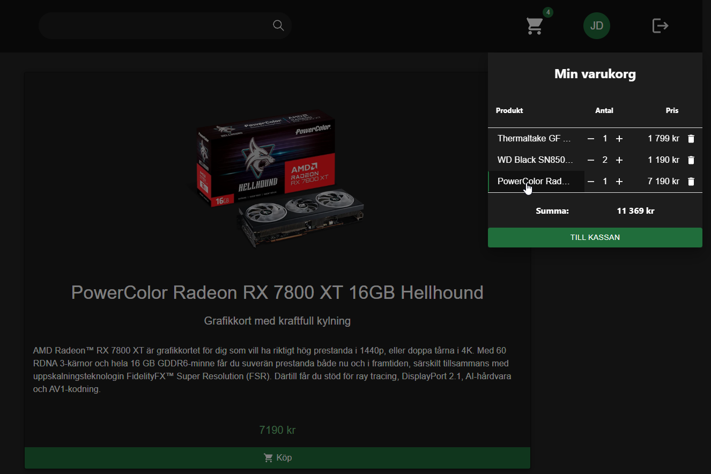
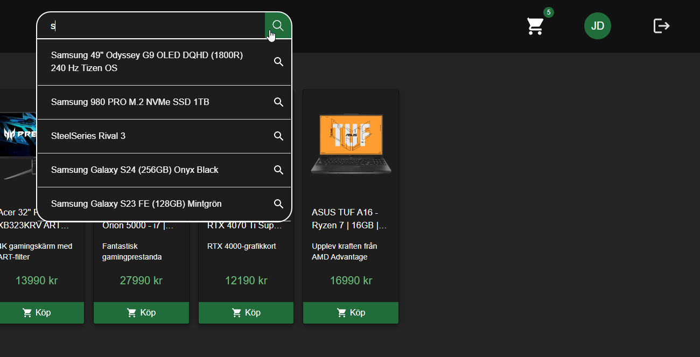

# React Webshop with Azure Integration

  

## Project Overview
This repository contains a webshop built using React for the front end and ASP.NET Core Web API for the backend, with Azure App Service and Azure SQL for hosting and database respectively. The webshop provides essential e-commerce functionalities, including item search with autocomplete, adding items to the shopping cart, adjusting item quantities, various product categories, user registration, and login.

## Features
### Search Functionality:
Utilizes autocomplete for efficient and user-friendly item search.

### Shopping Cart:
Allows users to add items to their shopping cart.
Provides options to increase, decrease, or remove items from the cart.

### Product Categories:
Implements different categories to organize and display various items.

### User Authentication:
Enables user registration for new customers. Facilitates user login for a personalized shopping experience using ASP.NET Core Identity and cookies.

### Technologies Used
React: Front-end development framework for building the user interface.

ASP.NET Core Web API: Back-end framework for handling HTTP requests and responses.

Azure App Service: Cloud-based platform for hosting the web application.

Azure SQL: Fully managed relational database service for storing application data securely.
